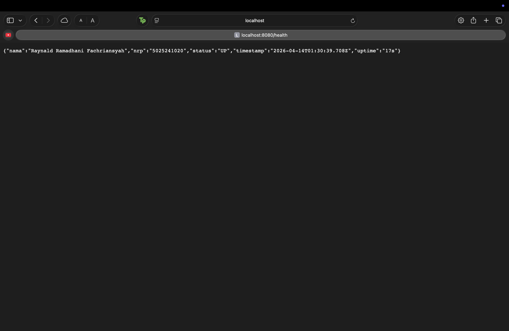
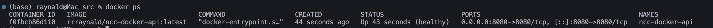
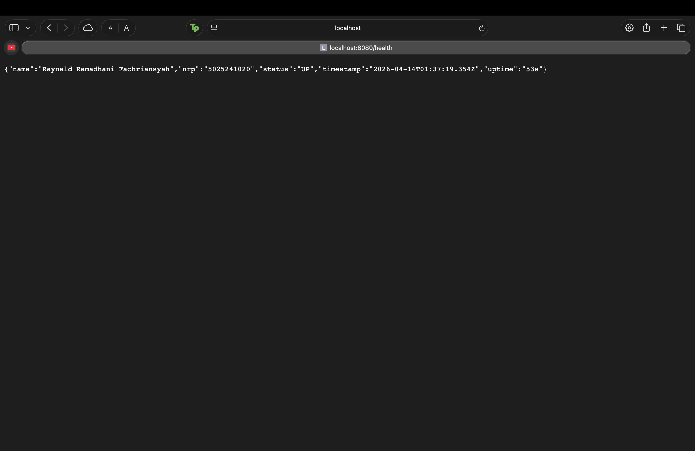
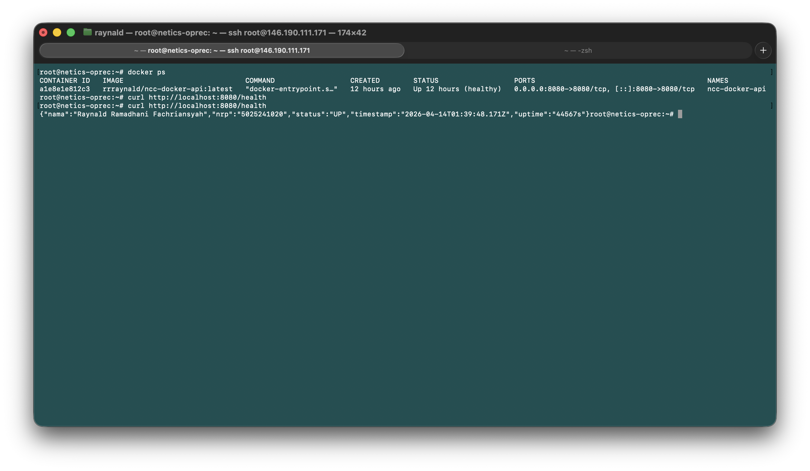
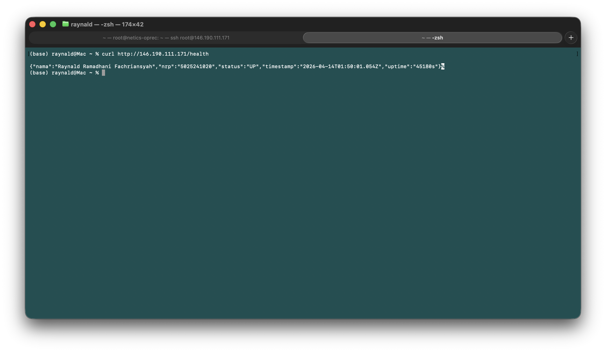
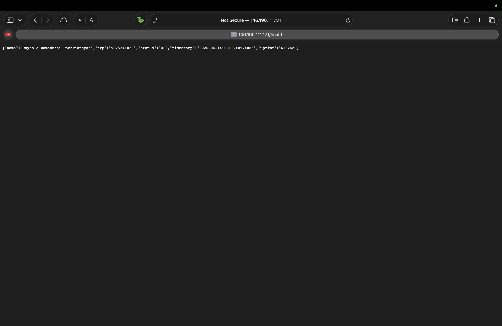

# OPREC Admin NCC Modul 1 - Docker

- **Nama:** Raynald Ramadhani Fachriansyah
- **NRP:** 5025241020

## Deskripsi Soal

Pada tugas modul 1 Lab NCC ini, kami diminta untuk mengimplementasikan containerization pada sebuah service sederhana, dengan detail sebagai berikut:

1. Membuat sebuah service yang menyediakan endpoint `/health` untuk health check dan mengembalikan status sukses (200 OK).
2. Menjalankan service tersebut menggunakan Docker.
3. Melakukan deployment Virtual Machine di VPS.
4. Memastikan endpoint `/health` dapat diakses secara publik.
5. Mengoptimasi image dan konfigurasi Docker dengan multi-stage build, base image Alpine, HEALTHCHECK, docker-compose, environment variable, `.dockerignore`, restart policy, dan port configuration.
6. Mendokumentasikan pengerjaan dalam laporan.

## Tech Stack

| Teknologi             | Kegunaan                                                                  |
| --------------------- | ------------------------------------------------------------------------- |
| **Node.js + Express** | Framework untuk pembuatan API server                                      |
| **Docker**            | Containerization service                                                  |
| **DigitalOcean**      | VPS publik tempat API di-deploy                                           |
| **Nginx**             | Reverse proxy yang meneruskan request dari port 80 ke container port 8080 |

## Penjelasan Alur Pengerjaan

### 1. Membuat API dengan Node.js + Express

File: [src/index.js](./src/index.js)

```javascript
const express = require("express");
const app = express();
const PORT = process.env.PORT || 8080;

app.get("/health", (req, res) => {
  res.status(200).json({
    nama: "Raynald Ramadhani Fachriansyah",
    nrp: "5025241020",
    status: "UP",
    timestamp: new Date().toISOString(),
    uptime: `${Math.floor(process.uptime())}s`,
  });
});

app.listen(PORT);
```

- `process.env.PORT || 8080` -> setup port fleksibel dengan fallback ke 8080.
- `res.status(200)` —> mengembalikan HTTP 200 OK.
- `new Date().toISOString()` -> menghasilkan timestamp dalam standar UTC.
- `process.uptime()` -> digunakan untuk mendapatkan uptime server secara native.

#### Testing API di Lokal dan Dokumentasi

Sebelum lanjut ke tahap selanjutnya, kita harus memastikan API berjalan dengan baik di lokal dan ouputnya sesuai dengan yang dibutuhkan. Testing API lokal dijalankan menggunakan:

1. Run server:

```bash
node src/index.js
```

2. Curl endpoint:

```bash
curl http://localhost:8080/health
```



**Kesimpulan**

Dari hasil testing, output API berhasil berjalan sesuai dengan yang diharapkan, maka kita bisa lanjut ke tahap selanjutnya.

### 2. Containerization dengan Docker (Multi-Stage Build)

#### File: [src/Dockerfile](./src/Dockerfile)

```dockerfile
# Build
FROM node:20-alpine AS build
WORKDIR /usr/src/app

COPY package*.json ./

RUN npm install --production
COPY . .

# Production
FROM node:20-alpine
WORKDIR /usr/src/app

COPY --from=build /usr/src/app/ ./

EXPOSE 8080

HEALTHCHECK --interval=30s --timeout=3s --start-period=5s --retries=3 \
  CMD wget -qO- http://localhost:8080/health || exit 1

CMD ["node", "index.js"]
```

Optimasi yang diterapkan:

- Multi-stage build, memisahkan stage `build` dan `production`, menghasilkan image yang lebih clean dan ringan.
- Menggunakan base image `node:20-alpine` untuk ukuran yang ringan dan stabil.
- `HEALTHCHECK`, docker cek endpoint `/health` secara otomatis setiap 30 detik. Container yang gagal healthcheck berturut-turut selama 3 kali akan ditandai `unhealthy`, sehingga monitoring lebih mudah.
- `EXPOSE 8080`, mendeklarasikan port yang digunakan oleh container.

#### File [.dockerignore](./src/.dockerignore)

```
node_modules/
*.log
.env
.git
.gitignore
Dockerfile*
.dockerignore
docker-compose.yml
*.md
.DS_Store
.vscode
```

- `.dockerignore` digunakan untuk mengecualikan file2 yang tidak diperlukan dalam image untuk mempercepat build dan mengurangi ukuran image.

### 3. Docker Compose

#### File: [src/docker-compose.yml](./src/docker-compose.yml)

```yaml
services:
  api:
    image: rrraynald/ncc-docker-api:latest
    build:
      context: .
      dockerfile: Dockerfile
    container_name: ncc-docker-api
    ports:
      - "${HOST_PORT:-8080}:8080"
    env_file:
      - .env
    restart: unless-stopped
```

**Fitur yang diterapkan:**

- `image` -> nama image yang akan digunakan
- `build` -> konfigurasi build untuk membuat image dari Dockerfile
- `ports` -> mapping port dari host ke container, menggunakan environment variable `HOST_PORT`
- `env_file` -> memuat environment variable dari file `.env`, environment variable dipisahkan untuk best practice.
- `restart` -> penerapan restart policy pada container.

#### File [.env](./src/.env)

```
NODE_ENV=production
PORT=8080
HOST_PORT=8080
```

File ini digunakan untuk menyimpan konfigurasi _Key_ dan _Value_, sehingga memudahkan pengelolaan konfigurasi tanpa harus mengubah kode sumber atau Dockerfile.

#### Testing Docker di Lokal

1. Build dan run image:

```bash
docker compose up -d --build
```

2. Cek container dan curl endpoint:

```bash
docker ps
curl http://localhost:8080/health
```




**Kesimpulan**
Dari hasil testing, container berhasil berjalan dengan baik dan endpoint `/health` dapat diakses sesuai dengan yang diharapkan. Maka kita bisa lanjut ke tahap deployment di VPS.

### 4. Deployment di VPS

Detail VPS:

- DigitalOcean Droplet Ubuntu 24.04 LTS (Singapore)
- 4 vCPU, 8GB RAM
- Authentication menggunakan SSH key `ed25519`

#### 4a. Clone Repository di VPS

```bash
ssh root@146.190.111.171

cd /opt
git clone -b Tugas-1 https://github.com/rrraynald/NCC-Oprec-Admin.git ncc-docker
cd ncc-docker/src
```

#### 4b. Install Docker Service

```bash
apt update
apt install -y ca-certificates curl gnupg

install -m 0755 -d /etc/apt/keyrings
curl -fsSL https://download.docker.com/linux/ubuntu/gpg -o /etc/apt/keyrings/docker.asc
chmod a+r /etc/apt/keyrings/docker.asc

echo "deb [arch=$(dpkg --print-architecture) signed-by=/etc/apt/keyrings/docker.asc] https://download.docker.com/linux/ubuntu $(. /etc/os-release && echo "$VERSION_CODENAME") stable" | tee /etc/apt/sources.list.d/docker.list > /dev/null

apt update
apt install -y docker-ce docker-ce-cli containerd.io docker-buildx-plugin docker-compose-plugin
systemctl enable docker
systemctl start docker
```

#### 4c. Buat Variabel `.env` dan Start Container

Karena `.env` tidak ikut terpush ke repository, kita harus buat file `.env` di VPS dengan isi yang sama:

```bash
cat > .env <<'EOF'
NODE_ENV=production
PORT=8080
HOST_PORT=8080
EOF
```

Lalu build dan start container:

```bash
docker compose up -d --build
curl http://localhost:8080/health
```

**Hasil testing di lokal VPS:**



#### 4d. Setup Nginx sebagai Reverse Proxy

```bash
apt update
apt install -y nginx
```

Ubah konfigurasi Nginx di `/etc/nginx/sites-available/default`:

```nginx
location / {
    proxy_pass http://localhost:8080;
    proxy_http_version 1.1;
    proxy_set_header Host $host;
    proxy_set_header X-Real-IP $remote_addr;
    proxy_set_header X-Forwarded-For $proxy_add_x_forwarded_for;
    proxy_set_header X-Forwarded-Proto $scheme;
}
```

Restart Nginx:

```bash
systemctl restart nginx
ufw allow 'Nginx Full'
ufw allow 8080
```

**Hasil testing endpoint `/health` secara publik:**

- Via Nginx (port 80):

```bash
curl http://146.190.111.171/health
```




## URL Deployment

| Resource          | Link                                                      |
| ----------------- | --------------------------------------------------------- |
| Health Endpoint   | http://146.190.111.171/health                             |
| GitHub Repository | https://github.com/rrraynald/NCC-Oprec-Admin/tree/Tugas-1 |
